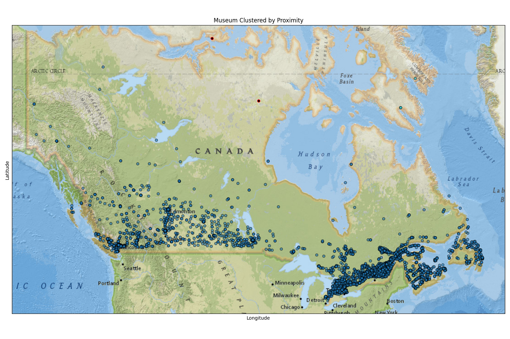
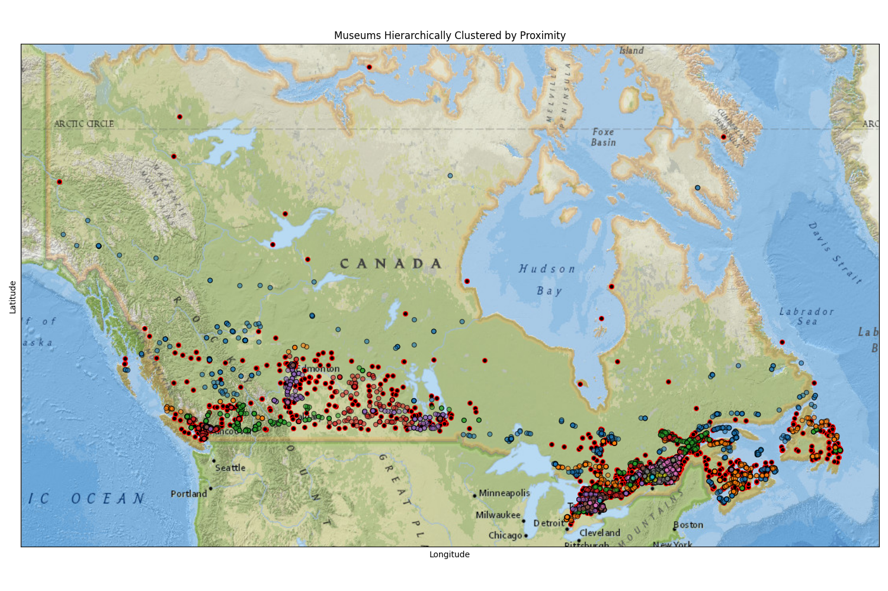

# 🗺️ Museum Clustering in Canada with DBSCAN and HDBSCAN

This project analyzes a dataset of cultural and museum facilities in Canada, clustering them based on their geographic proximity using DBSCAN and HDBSCAN algorithms.


## 🎯 Objective

The objective of this project is to analyze the geographical distribution of museums and art facilities in Canada and uncover meaningful spatial patterns using unsupervised machine learning techniques — specifically, density-based clustering algorithms like DBSCAN and HDBSCAN.

Museums and galleries often cluster in regions of high tourist activity, cultural relevance, or urban development. By applying clustering algorithms, we aim to:
- **Identify natural groupings** of museums based on their geographical proximity.
- **Detect isolated or outlier museums**, which could have implications for accessibility or tourism strategy.
- **Compare the effectiveness** of DBSCAN vs. HDBSCAN for spatial clustering in real-world, noisy datasets.
- **Visualize the clusters** on geographic maps to offer intuitive and actionable insights for cultural planning, tourism enhancement, or data-driven policymaking.

This approach provides a way to quantify and visualize how cultural institutions are spatially organized without relying on labeled training data, making it a powerful tool for exploratory spatial data analysis.


## 🧰 Tools Used

- Python
- Pandas, Numpy, Scikit-learn
- DBSCAN, HDBSCAN
- GeoPandas, Contextily, Shapely
- Matplotlib

## 📊 Dataset

Dataset Source: [Open Data Canada - Cultural Facilities](https://cf-courses-data.s3.us.cloud-object-storage.appdomain.cloud/r-maSj5Yegvw2sJraT15FA/ODCAF-v1-0.csv)

The dataset includes:
- Facility name
- Latitude & Longitude
- Cultural facility type
- Address/location information

## 🧪 Clustering Algorithms

### ✅ DBSCAN
- Density-based clustering algorithm
- Uses fixed radius (ε) to find dense clusters

### ✅ HDBSCAN
- Hierarchical version of DBSCAN
- More flexible with varying density clusters

## 📈 Results

We identified clusters of museums primarily in urban centers like Toronto, Montreal, and Vancouver. The HDBSCAN model performed better at separating noise and capturing real-world density.

### 🖼️ Sample Output:
- Clustered Map with DBSCAN
  
  
- Clustered Map with HDBSCAN

  

## 📌 Future Work

- Add interactive map with Folium or Leaflet
- Try clustering with additional features (type of museum, size)
- Integrate dashboard with Streamlit

## 🚀 Run This Project

1. Clone this repo
   ``` bash
   git clone https://github.com/0quaaD/Museum-Clustering-Model.git
   cd Museum-Clustering-Model
   ```
2. Create and acitvate the **Python** environment:
    ``` bash
     python -m venv myenv 
    ```
  - On mac/linux:  
    ```python
    source myenv/bin/activate
    ```
 - On Windows:
   ```powershell
    myenv\bin\activate
   ```
4. Install dependencies:
   ``` bash
   pip install -r requirements.txt
   ```
5. Run the Jupyter Notebook or Python script:
   - As python script:
     
     ```bash
      python3 main.py
     ```
   - As Jupyter Notebook:
     ```bash
      jupyter-notebook
     ```
## ⌛ Contributions

Contributions are welcome! If you’d like to contribute to this project, feel free to fork the repository, create a new branch, and submit a pull request.

Please make sure to follow the standard Git workflow and provide meaningful commit messages.

## 📜 License

MIT License
